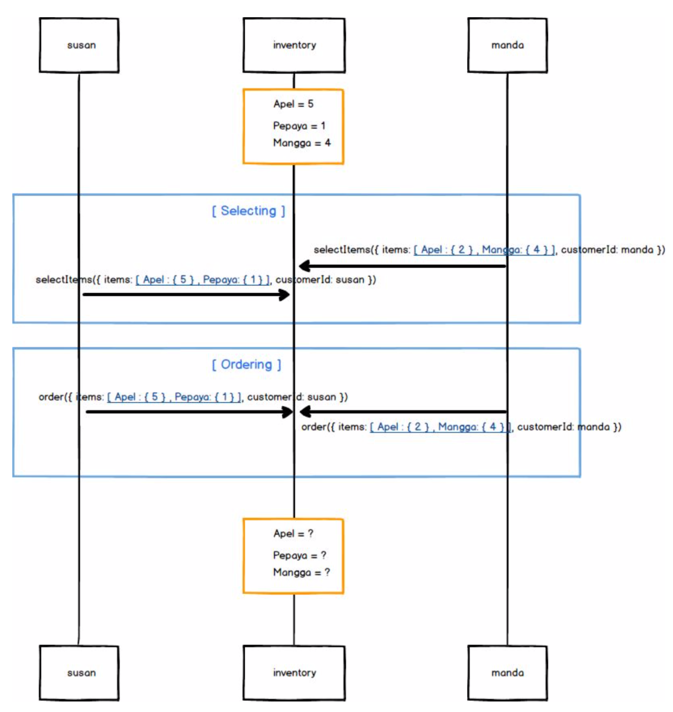

# order-lock
### Use Case
1. (Selecting) As a customer I can select item which I want, if stock is available
2. (Ordering) As a customer I can order items which I’ve already selected is stock available
Situations which must to be handled
1. Susan and Manda is ordering apple concurrently
2. Apple stock = 5, How do you serve Susan and Manda order?

#### Things to do to run this project:
1. Clone this repo : `git clone https://github.com/hendisantika/order-lock.git`
2. Go to the folder it self : `cd order-lock`
3. Make sure you have installed python on your environment.
4. Make sure you have installed maven on your environment.
5. If you don't have maven you can run by this command: `./mvnw clean spring-boot:run`

